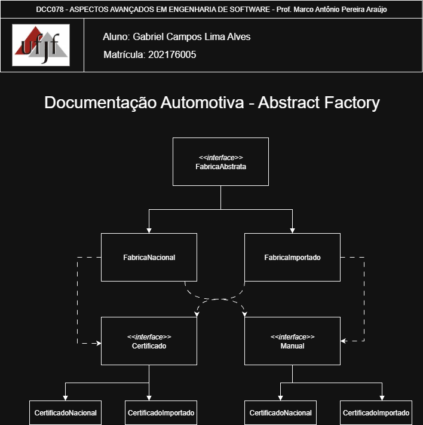

# Abstract Factory — Sistema de Documentação Automotiva

<p align="center">
  <a href="https://www.ufjf.br/" rel="noopener">
    
  </a>
</p>

<h3 align="center">DCC078-2025.3-A — Aspectos Avançados em Engenharia de Software (UFJF/ICE)</h3>

---

## 📝 Sumário
- [Sobre](#sobre)
- [Diagrama Nível de Projeto](#diagrama)
- [Funcionalidades](#funcionalidades)
- [Tecnologias](#tecnologias)
- [Exemplo de Uso](#exemplo)
- [Como Executar e Testes](#testes)
- [Autor](#autor)

## 🧐 Sobre <a name="sobre"></a>
> **Disciplina:** DCC078 – Aspectos Avançados em Engenharia de Software  
> **Projeto:** Sistema de Registro de Logs com Singleton
> **Docente:** Prof. Marco Antônio Pereira Araújo
> **Data de entrega:** 07/10/2025  
> **Aluno:** [Gabriel Campos Lima Alves](#autor)

### Padrão Abstract Factory
Implementação do padrão **Abstract Factory** para criação de famílias de produtos relacionados no contexto automotivo.
O **Abstract Factory** é um padrão criacional que fornece uma interface para criar famílias de objetos relacionados sem especificar suas classes concretas, demonstrando:
- Criação de famílias consistentes de produtos (Certificado e Manual)
- Isolamento das classes concretas do cliente
- Facilita troca entre famílias de produtos (Nacional/Importado)

## 📐 Diagrama de Classe <a name="diagrama"></a>
O diagrama abaixo representa a arquitetura do projeto, destacando a aplicação do padrão **Abstract Factory** no sistema de documentação automotiva:

<p align="center">
  
</p>

## 🚀 Funcionalidades <a name="funcionalidades"></a>
### Sistema de Documentação Automotiva Implementado
- **FabricaAbstrata**: Interface para criar famílias de documentos
- **FabricaNacional/FabricaImportado**: Fábricas concretas especializadas
- **Certificado/Manual**: Interfaces de produtos abstratos
- **Veiculo**: Cliente que utiliza as fábricas para obter documentos

### Recursos
- ✅ Famílias consistentes de produtos (Nacional/Importado)
- ✅ Acoplamento fraco entre cliente e produtos concretos
- ✅ Facilidade para adicionar novas famílias de veículos
- ✅ Garantia de compatibilidade entre produtos da mesma família
- ✅ Inversão de dependência no cliente
- ✅ Extensibilidade para novos tipos de documentação

##  Tecnologias <a name="tecnologias"></a>
- **Java 11+**
- **JUnit 5** - Framework de testes
- **Maven** - Gerenciamento de dependências
- **Git** - Controle de versão


## 📊 Exemplo de Uso <a name="exemplo"></a>
```java
// Criando veículo nacional
FabricaAbstrata fabricaNacional = new FabricaNacional();
Veiculo veiculoNacional = new Veiculo(fabricaNacional);

System.out.println(veiculoNacional.emitirCertificado());
// Output: "Certificado de Veículo Nacional"

System.out.println(veiculoNacional.emitirManual());
// Output: "Manual de Veículo Nacional"

// Criando veículo importado
FabricaAbstrata fabricaImportado = new FabricaImportado();
Veiculo veiculoImportado = new Veiculo(fabricaImportado);

System.out.println(veiculoImportado.emitirCertificado());
// Output: "Certificado de Veículo Importado"

System.out.println(veiculoImportado.emitirManual());
// Output: "Manual de Veículo Importado"

// Facilidade para trocar famílias
public void processarVeiculo(FabricaAbstrata fabrica) {
    Veiculo veiculo = new Veiculo(fabrica);
    // Produtos sempre serão consistentes com a fábrica escolhida
}
```

## 🧪 Como Executar e Testes <a name="testes"></a>
### Cobertura de Testes
- ✅ **Testes de Certificados**: Validam emissão para veículos nacionais e importados
- ✅ **Testes de Manuais**: Verificam geração de manuais para ambas as famílias
- ✅ **Testes do Padrão**: Confirmam comportamento das fábricas abstratas
- ✅ **Testes de Integração**: Validam consistência entre produtos da mesma família

### Pré-requisitos
- Java 11 ou superior
- Maven 3.6+

### Comandos
```bash
# Compilar o projeto
mvn clean compile

# Executar testes
mvn test

# Executar o programa principal
mvn exec:java -Dexec.mainClass="padroescriacao.abstractfactory.Main"

# Empacotar
mvn package
```

## 👨‍💻 Autor <a name="autor"></a>
**Gabriel Campos Lima Alves**  
Matrícula: 202176005  
Email: campos.gabriel@estudante.ufjf.br  
GitHub: [@CamposCodes](https://github.com/CamposCodes)

---

*Projeto de uso acadêmico exclusivo para a disciplina DCC078 - UFJF*
